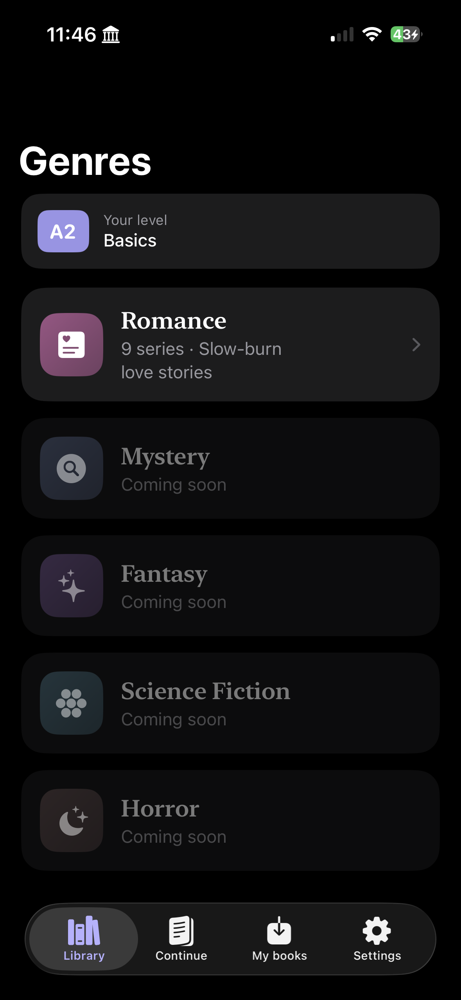
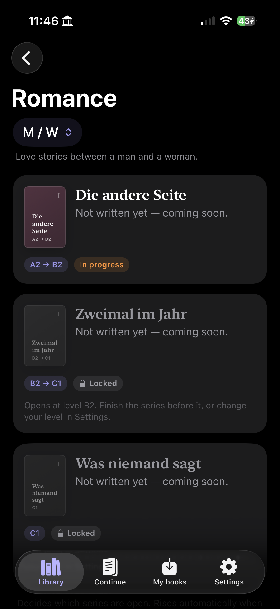
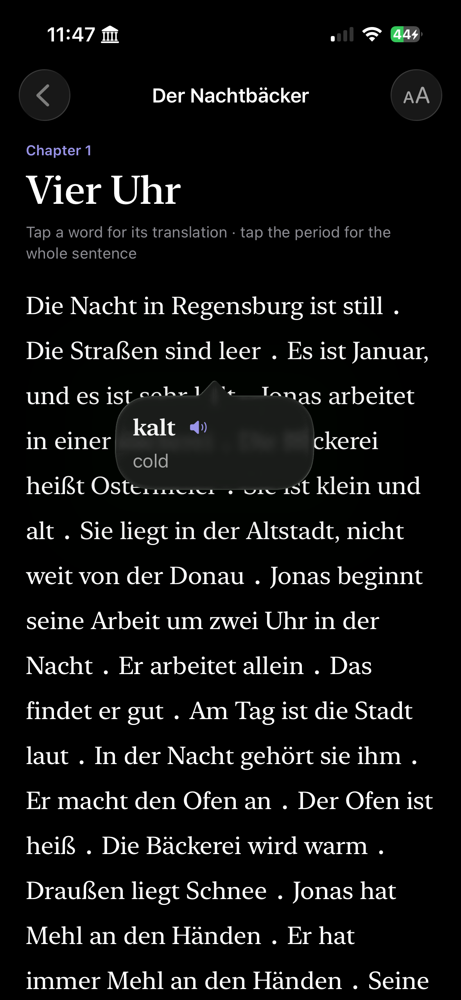
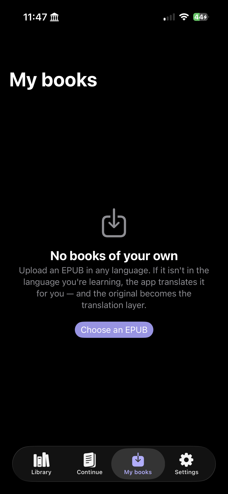

# Lesen

  
  

  
  

Learn German by reading stories you actually want to read.

A native iOS and macOS app for **graded reading**: short novels written to a
deliberate vocabulary ladder, where tapping a word shows its translation and
tapping the period at the end of a sentence shows the whole sentence.

## How it works

- **Tap a word** → its translation, with on-device German speech.
- **Tap the `.`** → the full sentence translation, as a capsule that fades out.
- Nothing is tracked per word. Vocabulary recurs *by design* in the writing —
  the spaced repetition lives in the content, not in a scheduler.

## Content

**Book series** with a four-volume shared-universe story, written as a ladder from A1 to C1.

## Import your own books

Load a DRM-free EPUB in any language. If it isn't in the language you're
learning, the app translates it — and the original text becomes the
translation layer, aligned one-to-one by construction. All on-device via
Apple's Translation framework; nothing is uploaded.

## Build

- Xcode 26+, iOS 18 / macOS 15 minimum
- One dependency: [ZIPFoundation](https://github.com/weichsel/ZIPFoundation) (SPM)
- Sandbox: enable **User Selected File ▸ Read** for EPUB import

See `MACOS-SETUP.md` and `EPUB-IMPORT-SETUP.md`.

## Layout

| Path | |
|---|---|
| `Lesen/` | app source |
| `Lesen/Resources/books.json` | all volumes + glossary |
| `build_content.py` | markdown volumes → books.json |
| `build_glossary.py` | attaches the German→English glossary |
| `Zwischen-Uns/` | the stories, in markdown |
